# Ankerkladde

<p align="center">
  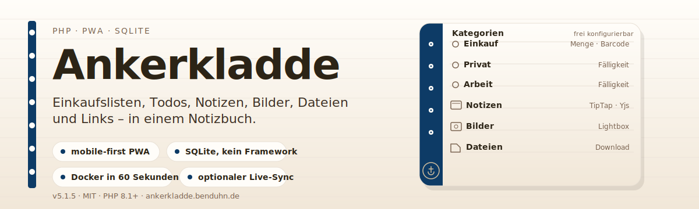
</p>

<p align="center">
  <a href="https://ankerkladde.benduhn.de">Live-Demo</a> ·
  <a href="#schnellstart">Schnellstart</a> ·
  <a href="#api-in-kurzform">API</a> ·
  <a href="#tests">Tests</a>
</p>

**Ankerkladde** ist eine mobile-first PHP-Webanwendung und PWA für Einkaufslisten, Todos, Notizen, Bilder, Dateien und Links. Daten liegen in SQLite, das Frontend ist Vanilla-JS-ESM, der Notizeditor ist TipTap – und ein optionaler WebSocket-Dienst liefert Live-Sync ohne Reload.

## Was du bekommst

<p align="center">
  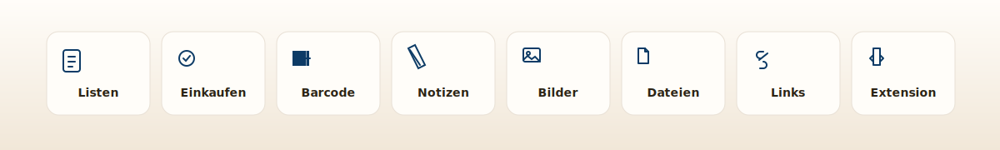
</p>

- **Frei konfigurierbare Kategorien** pro Nutzer – mit Typen für Einkaufslisten, Aufgaben, Notizen, Bilder, Dateien und Links. Anlegen, umbenennen, sortieren, ausblenden.
- **Zwei Arbeitsmodi** nebeneinander: `Liste` zum Bearbeiten, `Einkaufen` zum schnellen Abhaken unterwegs. Inline-Edit, Drag-and-Drop, Anheften, Sammellöschen, Volltextsuche per FTS5.
- **Medien sauber gehandhabt** – genau ein Anhang pro Item, Uploads unter `data/uploads/` (nie im Webroot), Bilder bekommen Thumbnails wenn `gd` verfügbar ist, Dateien werden gestreamt statt ausgeliefert.
- **Rich-Text-Notizen mit TipTap**, auf Wunsch über Yjs/WebSocket live synchronisiert. Versionsänderungen lösen einen Reload aus, andere offene Tabs sehen CRUD-Änderungen ohne Refresh.
- **Barcode-Scanner** mit optionalem Open-Food-Facts-Katalog und **Magic Bar** (Google Gemini) für Freitext wie „Zutaten für Lasagne". Beides funktioniert auch ohne Katalog bzw. ohne Key.
- **Installierbare PWA** mit Service Worker, Offline-Seite, Share Target und Update-Reload.
- **Themes & Erweiterung** – kuratierte Light- und Dark-Themes, plus eine Browser-Erweiterung für Chrome/Edge/Firefox, die sich per `X-API-Key` authentifiziert.

## So sieht es aus

<p align="center">
  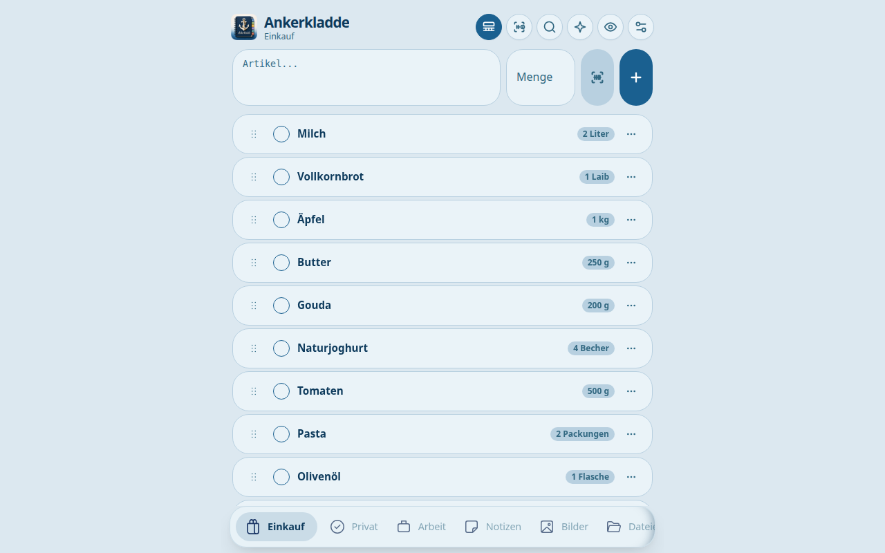
</p>

<p align="center">
  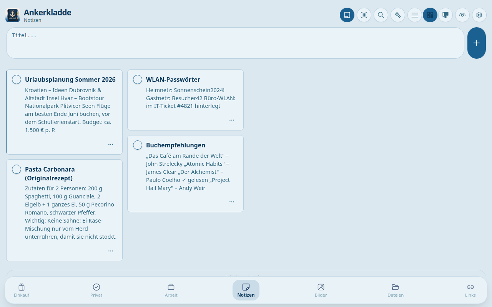
  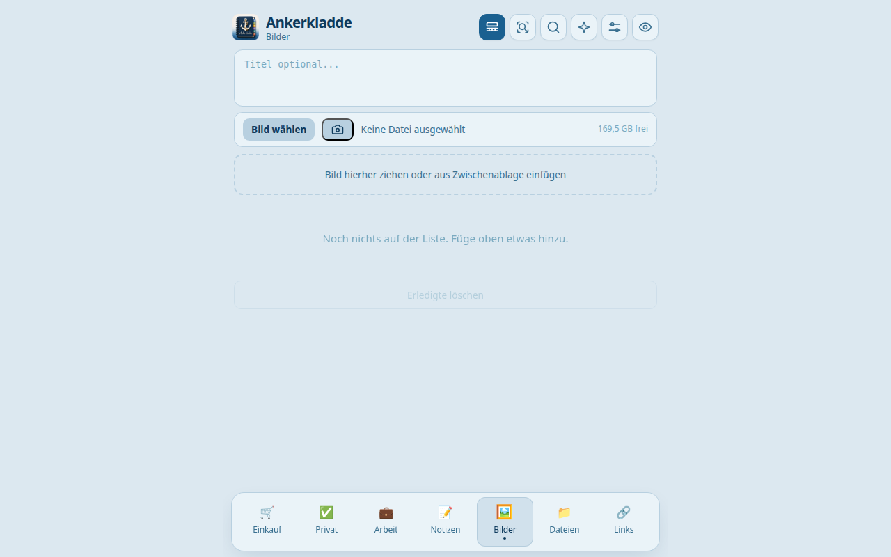
  <br>
  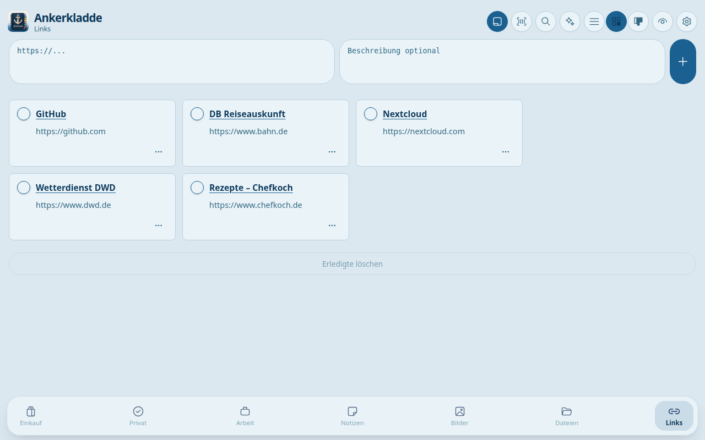
  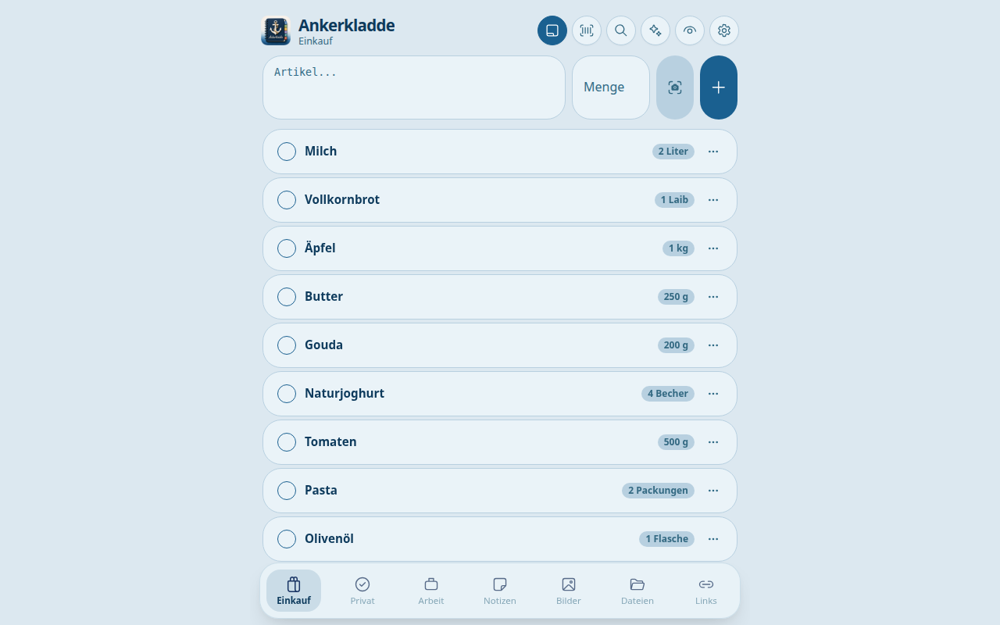
</p>

<p align="center">
  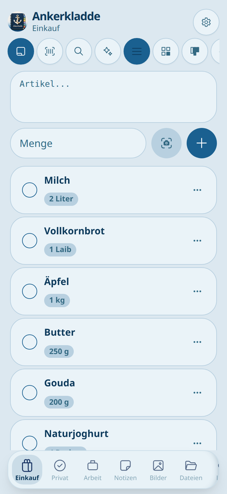
  &nbsp;&nbsp;
  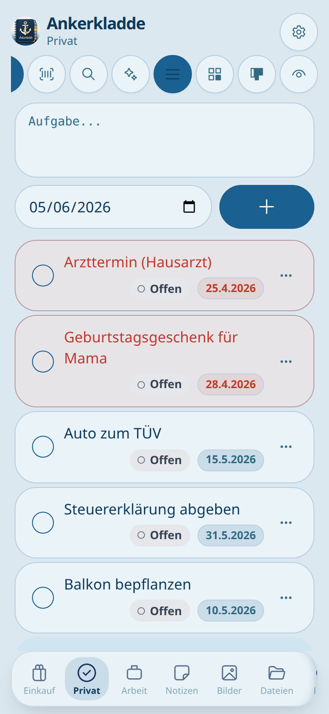
  &nbsp;&nbsp;
  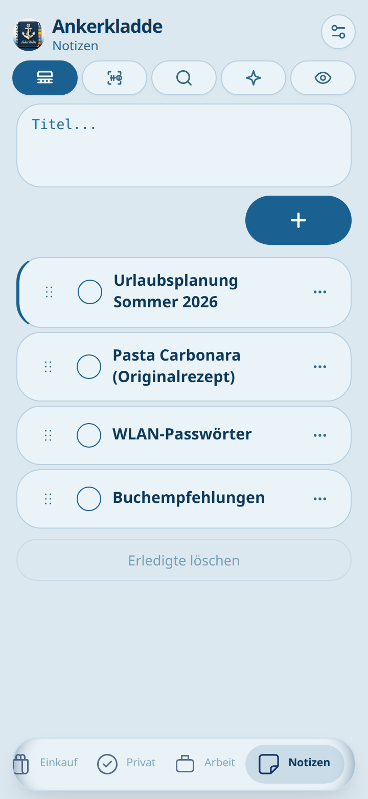
  &nbsp;&nbsp;
  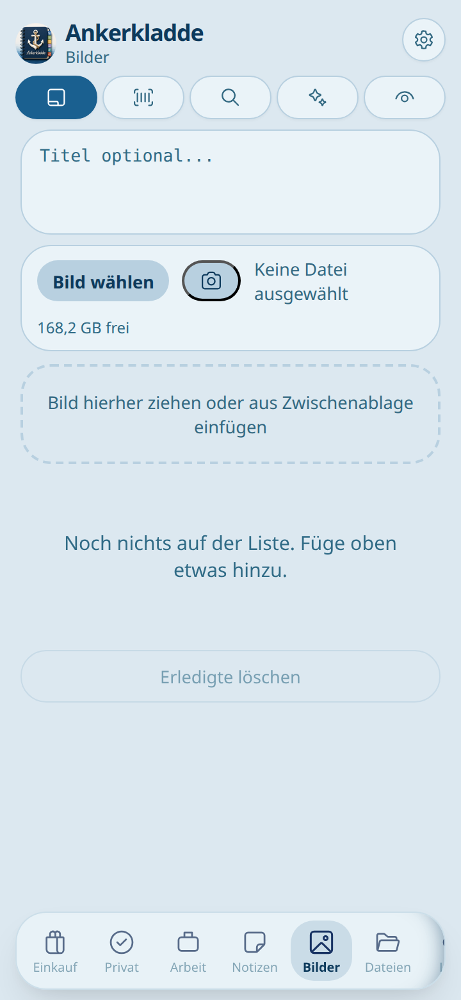
</p>

## Architektur

<p align="center">
  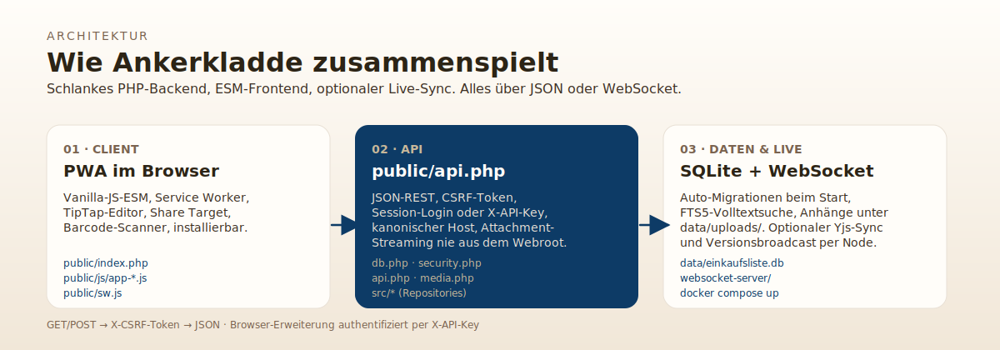
</p>

| Pfad | Zweck |
| --- | --- |
| `public/` | App-Shell, Login, Settings, JSON-API, PWA-Assets |
| `public/js/` | Frontend als ESM-Module, Komposition über `createXxxController(deps)` |
| `db.php` | SQLite-Init, Auto-Migrationen, Kategorien-, Nutzer- und Produkt-Helper |
| `security.php` | Session, CSRF, kanonischer Host, Proxy-Logik |
| `src/` | `CategoryRepository`, `ItemRepository`, `UserRepository`, `FileHelper`, `ImageHelper`, `SettingsController`, `AiClient` |
| `websocket-server/` | Yjs-Räume für Notizen, Versionsbroadcasts |
| `browser-extension/` | Chrome/Edge/Firefox-Erweiterung, baut sich on demand als ZIP |
| `scripts/` | Smoke-Tests, DB-Migration, Open-Food-Facts-Import, Helfer |
| `tests/ui/` | Playwright-Suite |

**Daten:** `data/einkaufsliste.db` (Hauptdaten), optional `data/products.db` (Produktkatalog). Migrationen laufen additiv beim Start – nie destruktiv.

## Schnellstart

### Docker

```bash
git clone https://github.com/oliverbenduhn/ankerkladde.git
cd ankerkladde
docker compose up -d --build
docker exec -it ankerkladde php scripts/create-admin.php
```

Anschließend unter <http://localhost:8083> einloggen. Daten landen unter `./data`, Apache proxyt `/ws/` auf den WebSocket-Container, `/healthz` ist mit dabei.

### Lokal ohne Docker

```bash
php -S 127.0.0.1:8000 -t public public/router.php
php scripts/create-admin.php
```

Dann `http://127.0.0.1:8000/login.php` aufrufen. Weitere Nutzer per `php scripts/create-user.php` oder über die Umgebungsvariablen `EINKAUF_ADMIN_USER` / `EINKAUF_ADMIN_PASS` bzw. `EINKAUF_REGULAR_USER` / `EINKAUF_REGULAR_PASS`. Im Docker-Container wird bei einer frischen Installation automatisch ein initialer Admin (`admin` / `admin1234`) angelegt – Passwortwechsel beim ersten Login ist Pflicht.

> **Hinweise:** Kamera, PWA-Installation und einige Browser-APIs brauchen HTTPS oder localhost. `localhost` und `127.0.0.1` werden nie auf den kanonischen Produktionshost umgeleitet. Beim nackten `php -S` fehlt der Reverse Proxy für `/ws/`; die App läuft trotzdem, aber Live-Sync und Yjs-Notizen erst mit zusätzlichem Setup (siehe [WEBSOCKET-SETUP.md](WEBSOCKET-SETUP.md)).

## API in Kurzform

JSON-API unter `public/api.php`, genutzt von Web-App und Browser-Erweiterung.

| Action | Methode | Zweck |
| --- | --- | --- |
| `categories_list`, `categories_create`, `categories_update`, `categories_reorder`, `categories_delete` | `GET` / `POST` | Kategorien verwalten |
| `list`, `add`, `upload`, `update`, `toggle`, `delete`, `clear`, `reorder`, `pin` | `GET` / `POST` | Items und Anhänge bearbeiten |
| `search` | `GET` | Nutzerweite Volltextsuche (FTS5) |
| `product_lookup`, `product_details` | `GET` | Produktdaten per Barcode |
| `fetch_metadata` | `GET` | Titel/Beschreibung/Bild einer externen URL |
| `preferences` | `GET` / `POST` | Nutzerpräferenzen |

Browser-Sessions verwenden Session-Cookie + `X-CSRF-Token`. Die Browser-Erweiterung authentifiziert sich per `X-API-Key`. Im Docker-Stack überleben PHP-Sessions Container-Neustarts, solange das Volume bleibt.

## Voraussetzungen

- PHP 8.1+ (empfohlen 8.3, Docker nutzt `php:8.3-apache`)
- Erweiterungen: `pdo_sqlite`, `curl`, `mbstring`; für Bild-Thumbnails zusätzlich `gd`
- Node.js nur für WebSocket-Server, Playwright-UI-Tests und Extension-Builds

## Wichtige Umgebungsvariablen

| Variable | Standard | Zweck |
| --- | --- | --- |
| `EINKAUF_DATA_DIR` | `./data` bzw. `/data` im Container | Speicherort für SQLite-Dateien und Uploads |
| `ANKERKLADDE_CANONICAL_HOST` | `ankerkladde.benduhn.de` | Produktiver Hostname; leer lassen für freie Hosts |
| `ANKERKLADDE_SESSION_LIFETIME_DAYS` | `30` | Login-/Session-Gültigkeit; `0` = Browser-Session |
| `EINKAUF_TRUST_PROXY_HEADERS` | auto (nur lokal) | `X-Forwarded-*` vertrauen |
| `WS_NOTIFY_URL` | `http://127.0.0.1:3000/notify` | Update-Broadcast-Ziel aus `api.php` |
| `WS_HOST` / `WS_PORT` | `127.0.0.1` / `3000` | WebSocket-Broadcast aus `settings.php` |
| `EINKAUF_BOOTSTRAP_ADMIN_USER` / `_PASS` | `admin` / `admin1234` | Initialer Admin für frische Docker-Installationen |

## WebSocket und Live-Sync

Live-Updates und kollaborative Notizen brauchen den Node-Dienst aus `websocket-server/`. Mit Docker ist er bereits verdrahtet; für Apache/Nginx brauchst du zusätzlich den Reverse Proxy für `/ws/` und einen erreichbaren `/notify`-Endpoint. Details: [WEBSOCKET-SETUP.md](WEBSOCKET-SETUP.md) und [TipTapWebsocket.md](TipTapWebsocket.md).

## Open Food Facts importieren

Optional – die App läuft auch ohne Produktkatalog, nur Produktnamen und Detailseiten sind dann begrenzt.

```bash
bash scripts/update-openfoodfacts.sh
```

Das Skript schreibt nach `data/products.db` und braucht je nach Datensatz viel Speicherplatz.

## Browser-Erweiterung

Die Erweiterung schickt Seiten, Links, Bilder und Dateien direkt nach Ankerkladde.

```bash
php browser-extension/build-extension.php        # Chromium-Variante
php browser-extension/build-firefox.php          # Firefox-Variante
php browser-extension/build-icons.php            # optional, frische PNG-Icons
```

Mehr in [browser-extension/README.md](browser-extension/README.md).

## Sicherheit (Kurzfassung)

- Session-basierter Login mit Admin-/Normalnutzer-Rollen, CSRF-Schutz auf jedem schreibenden Request
- Kanonische Host-Weiterleitung für Produktion, Proxy-Header werden nur gezielt vertraut
- Attachment-Pfade werden ausschließlich serverseitig aus DB-Werten gebildet, nie aus Request-Daten
- `fetch_metadata` lädt nur externe öffentliche HTTP(S)-Ziele, nie aus dem LAN/Loopback
- Browser-Erweiterung nutzt API-Keys, nie Session-Cookies

## Tests

```bash
bash scripts/smoke-test.sh
bash scripts/test-db-migration.sh
php scripts/test-security.php
find . -path './.git' -prune -o -path './.worktrees' -prune -o -path './data' -prune -o -name '*.php' -print | sort | xargs -r -n1 php -l
```

UI-Smoke-Tests mit Playwright:

```bash
npm install
npm run test:ui:install
npm run test:ui
```

Die UI-Suite startet ihren eigenen PHP-Testserver und legt temporäre Daten unter `.tmp/ui-test-data/` an.

## Deployment

- Docker-Stack nutzt `php:8.3-apache` mit `rewrite`, `headers`, `proxy`, `proxy_http`, `proxy_wstunnel`
- Upload-Grenzen liegen in `public/.user.ini`
- Mitgelieferte Apache-Konfiguration setzt das DocumentRoot auf `public/`
- Für PWA, Kamera und installierbare Browser-Erlebnisse hinter HTTPS laufen lassen

## Weiterführende Dateien

- [WEBSOCKET-SETUP.md](WEBSOCKET-SETUP.md)
- [TipTapWebsocket.md](TipTapWebsocket.md)
- [browser-extension/README.md](browser-extension/README.md)
- [public/theme_update.md](public/theme_update.md)